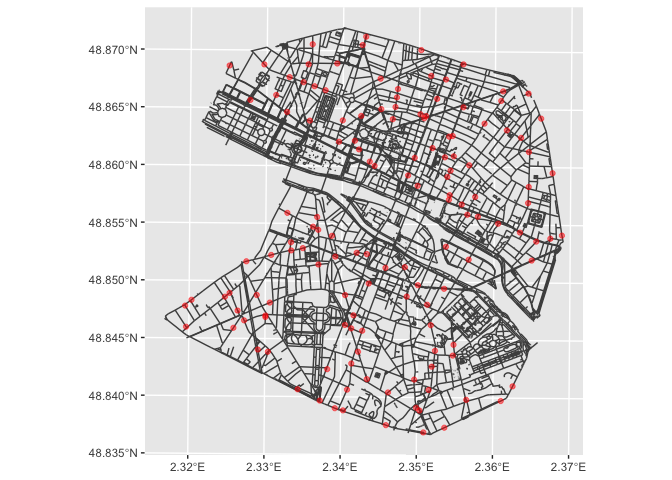

# spacetimeLPP R package

## Space-time point pattern analysis on planar network

spacetimeLPP is an R package facilitating the analysis of point patterns
on planar networks in time. In input, spatial data are considered in
`sf` format and outputs are in `tidy` formats to simplify the use of the
package. However, main calculations, e.g. distance matrices between
points on network, are performed using the `spatstat` package for its
computational speed.

## Installing

Install package from github:

``` r
library(remotes)
install_github(repo = "soduco/space_time_lpp")
```

## Distance computation between points on network and comparison with a random situation

A point pattern on planar network

``` r
library(spacetimeLPP)
```

    ## Le chargement a nécessité le package : magrittr

``` r
library(ggplot2)

ggplot() +
  geom_sf(data = paris_network, color = "grey30") +
  geom_sf(data = pharmacy, color = "red", alpha = 0.5)
```

<!-- -->

Computing shortest paths distances between pharmacy on network and 2
simulated point patterns

``` r
distances <- dist_with_sims(pp = pharmacy, network = paris_network, nsim = 2)
```

    ## Warning: Duplicated segments were ignored

    ## Warning: The `x` argument of `as_tibble.matrix()` must have unique column names if
    ## `.name_repair` is omitted as of tibble 2.0.0.
    ## ℹ Using compatibility `.name_repair`.
    ## ℹ The deprecated feature was likely used in the spacetimeLPP package.
    ##   Please report the issue to the authors.

    ## Warning: Duplicated segments were ignored

``` r
distances
```

    ## # A tibble: 28,359 × 5
    ##       Pi P     dist_pi_p   sim type      
    ##    <int> <chr>     <dbl> <int> <chr>     
    ##  1     2 1          448.     1 simulation
    ##  2     3 1         2422.     1 simulation
    ##  3     3 2         2401.     1 simulation
    ##  4     4 1         1479.     1 simulation
    ##  5     4 2         1679.     1 simulation
    ##  6     4 3         1649.     1 simulation
    ##  7     5 1          Inf      1 simulation
    ##  8     5 2          Inf      1 simulation
    ##  9     5 3          Inf      1 simulation
    ## 10     5 4          Inf      1 simulation
    ## # … with 28,349 more rows

Visualisation of distances

``` r
ggplot(data = distances, mapping = aes(x = dist_pi_p, color = type)) +
  geom_density()
```

    ## Warning: Removed 2004 rows containing non-finite values (stat_density).

<!-- -->
