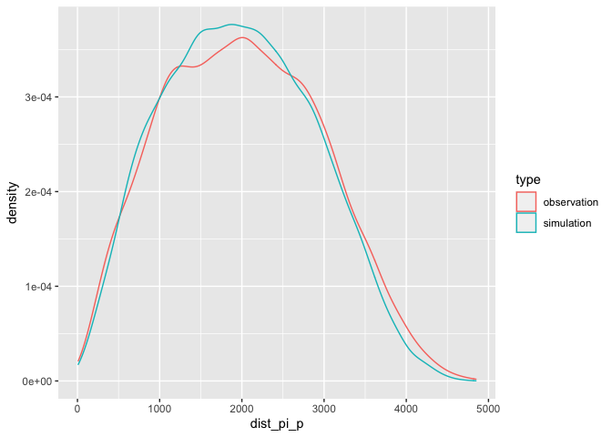

# spacetimeLPP R package

[](https://opensource.org/licenses/MIT)
 


## Space-time point pattern analysis on planar network

spacetimeLPP is a R package facilitating the analysis of point patterns
on planar networks over time, as usually considered in history or
archaeology, either by qualitative periods (e.g. 1820-1835 or the
Augustan period) or by time steps (e.g. 1820 and 1835). In input,
spatial data are considered in `sf` format and outputs are in `tidy` or
`sf` formats to simplify the use of the package. However, main
calculations, as distance matrices between points on network, are
performed using `spatstat` package for its computational speed.

## Recommendation to users

It is strongly recommended to users who wish to have a precise
understanding of the package to refer to the two publications on which
the functions are based:

-   A. Okabe and K. Sugihara, *Spatial Analysis along Networks:
    Statistical and Computational Methods*. Oxford: John Wiley &
    Sons, 2012. doi: 10.1002/9781119967101.

-   A. Baddeley, E. Rubak, et R. Turner, *Spatial Point Patterns.
    Methodology and Applications with R*. Boca Raton, Floride: Taylor &
    Francis Group, 2015. doi: 10.1201/b19708.

## Installing

Package currently exist as development on github.

Install package from github:

``` r
library(remotes)
install_github(repo = "soduco/space_time_lpp")
```

## Distance computation and comparison with a random situation

A point pattern on planar network

``` r
library(spacetimeLPP)
library(ggplot2)

ggplot() +
  geom_sf(data = paris_network, color = "grey30") +
  geom_sf(data = pharmacy, color = "red", alpha = 0.5)
```

<!-- -->

Computing shortest paths distances between pharmacies on network and 2
simulated point patterns

``` r
distances <- dist_with_sims(pp = pharmacy, network = paris_network, nsim = 2)
distances
```

    ## # A tibble: 28,359 × 5
    ##       Pi P     dist_pi_p   sim type      
    ##    <int> <chr>     <dbl> <int> <chr>     
    ##  1     2 1         1016.     1 simulation
    ##  2     3 1         2006.     1 simulation
    ##  3     3 2         2313.     1 simulation
    ##  4     4 1         2717.     1 simulation
    ##  5     4 2         2836.     1 simulation
    ##  6     4 3         1042.     1 simulation
    ##  7     5 1         1987.     1 simulation
    ##  8     5 2         2212.     1 simulation
    ##  9     5 3          837.     1 simulation
    ## 10     5 4          738.     1 simulation
    ## # … with 28,349 more rows

Visualisation of distances

``` r
ggplot(data = distances, mapping = aes(x = dist_pi_p, color = type)) +
  geom_density()
```

<!-- -->
